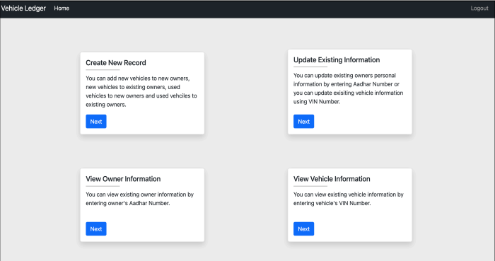

# Autometa

This is a project made by [Sparsh Gupta](https://github.com/Sparsh1101), [Riya Rege](https://github.com/RiyaR01), [Devansh Shah](https://github.com/twilight-warlock) & [Hardik Jain](https://github.com/hardikjain1708).
It a web application to record the complete lifecycle of vehicles, capturing crucial data from its initial sale, any incidents like accidents or thefts it encountered, and detailed information about all subsequent owners it was transferred to. We have addressed a significant challenge of vehicle fraud by implementing smart contracts written in Solidity, effectively transitioning an outdated manual system into a secure and efficient digital platform.


## Tech Used

- Python 3.9
- Django
- Ethereum Blockchain
- Solidity
- PostgreSQL
- Bootstrap5

## Running this project  

> **NOTE:** You can also skip the virtual environment steps (1-4)

1. Install virtual env on your system
```bash
pip install virtualenv
```

2. Run the command to create a virtual environment in a folder
```bash
python -m venv {your virtual env name}
```

3. A folder named {your virtual env name} will be created, enter the folder. ( The folder should contain some files and folders created for the virtual environment )

4. Now activate the virtual environment
```bash
Windows- .\Scripts\activate
```

```bash
Macos & Linux- source bin/activate )
```

5. Clone the repository
6. Create the env file using the env-sample file (Leave contract address empty, for MY_ADDRESS add blockchain wallet address, for PRIVATE_KEY add blockchain wallet private key, for SECRET_KEY generate django secret key from https://djecrety.ir/)
7. Run the following command from the root of the project

```bash
pip install -r requirements.txt
```

```bash
py manage.py makemigrations
```

```bash
py manage.py migrate
```

8. Create a super user to access the app

```bash
py manage.py createsuperuser
```
9. Create the database and mention details in .env file. Restore the database using Autometa.sql file.

10. Open deploy.py in registration folder, comment out line number 14 and uncomment line 15. Run command
```bash
py deploy.py
```

11. Revert the deploy.py file to its orignal state

12. Run the server
```bash
py manage.py runserver
```

## Images


---


---


---


---


